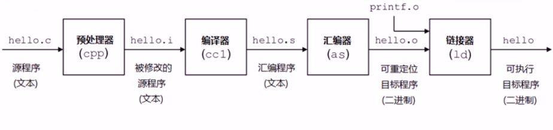
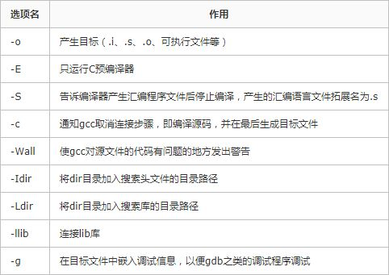

# Ref
1. https://zhuanlan.zhihu.com/p/76930507

gcc的全称是GNU Compiler Collection，它是一个能够编译多种语言的编译器。最开始gcc是作为C语言的编译器（GNU C Compiler），现在除了c语言，还
支持C++、java、Pascal等语言。gcc支持多种硬件平台。

## gcc编译程序的过程
gcc编译程序主要经过四个过程：

* 预处理（Pre-Processing）
* 编译 （Compiling）
* 汇编 （Assembling）
* 链接 （Linking）



## gcc常用选项


## 编译例子

### 方法一
一次过编译：
```
>>> gcc add.c main.c -o main
```

### 方法二

独立编译（好处是，当其中某个模块发送改变时，只需要编译该模块就行，不必重新编译所有文件，这样可以节省编译时间）
```
>>> gcc -Wall -c main.c -o main.o
>>> gcc -Wall -c add.c -o add.o
>>> gcc -Wall main.o add.o -o main
```

## 使用外部库

库又可以分为静态库与动态库：

** 静态库（.a）：程序在编译链接的时候把库的代码链接到可执行文件中。程序运行的时候将不再需要静态库。静态库比较占用磁盘空间，而且程序不可以共享静态库。运行时也是比较占内存的，因为每个程序都包含了一份静态库。

** 动态库（.so或.sa）：程序在运行的时候才去链接共享库的代码，多个程序共享使用库的代码，这样就减少了程序的体积。
一般头文件或库文件的位置在：

* /usr/include及其子目录底下的include文件夹
* /usr/local/include及其子目录底下的include文件夹
* /usr/lib
* /usr/local/lib
* /lib

### 静态库

下面这行 `ar rcs ` 命令将我们的add.o打包成静态库 libadd.a：
```
>>> ar rcs libadd.a add.o
```
ar表示 archive，是gun归档工具，rcs表示 replace and create，如果libadd之前存在，将创建新的libadd.a并将其替换。

使用静态库

```
>>> gcc -Wall main.c libadd.a -o main
```
还有另外一种使用方式：

```
>>> gcc -Wall -L. main.c -o main -ladd 【ladd是libadd的缩写】
```
其中 -L.表示库文件的位置在当前目录下，由于libhello.a是我们自己生成的，并存放在当前录下下，所以需要加上-L.选项。默认库文件是在系统的目录下进行搜索。
同样的，-I.选项用于头文件的搜索。

### 动态库

用 `gcc -shared -fPIC ` 命令生成一个动态共享库 libadd.so

```
>>> gcc -shared -fPIC add.o -o libadd.so
```
其中，shared选项表示生成共享库格式。fPIC表示产生位置无关码（position independent code），位置无关码表示它的运行、加载与内存位置无关，
可以在任何内存地址进行加载。

使用动态库

```
>>> gcc -Wall main.c libadd.so -o main
```

还有另外一种使用方式：

```
>>> gcc -Wall -L. main.c -o main -ladd 【ladd是libadd的缩写】
```

该命令与使用静态库的命令相同，但是在共享库与静态库共存的情况下，优先使用共享库。

## 搜索路径

共享库有时候并不不在当前的目录下，为了让gcc能够找得到共享库，有下面几种方法：

* 拷贝.so文件到系统共享库路径下，一般指/usr/lib
* 在~/.bash_profile文件中，配置LD_LIBRARY_PATH变量
* 配置/etc/ld.so.conf，配置完成后调用ldconfig更新ld.so.cache


库的搜索路径

库的搜索路径遵循几个搜索原则：从左到右搜索-I -l指定的目录，如果在这些目录中找不到，那么gcc会从由环境 变量指定的目录进行查找。
头文件的环境变量是C_INCLUDE_PATH,库的环境变量是LIBRARY_PATH.如果还是找不到，那么会从系统指定指定的目录进行搜索。


# struct的使用
分别定义两个结构体变量var1、与var2，两个变量的构造方式相同。但是，这种定义方式有着很大的不变，因为反复重写相同的东西
```
/* 方法1：*/
#include "stdio.h"

struct {
char a;
short b;
int c;
} var1;

struct {
char a;
short b;
int c;
} var2;
```

方法2少写了一次结构体，同时还能够实现两个变量的定义。不过，如果定义的结构体变量过多的时候代码就会有可读性以及维护性上的问题

```
/* 方法2：*/
#include "stdio.h"

struct {
char a;
short b;
int c;
} var1,var2;
```

方法3使用了结构体标签（可以认为一个tag就是一个结构体 {...}的别名），比方法2更方便，但这种定义方式每次需要写struct关键字
```
/* 方法3：*/
#include "stdio.h"

struct demo_tag {
char a;
short b;
int c;
} var1;

struct demo_tag var2;
```
方法4代码中的结构体标签（demo_tag）其实是没有用了的，可以去掉，是最简省的一种方式
```
方法4：
#include "stdio.h"

typedef struct demo_tag {
char a;
short b;
int c;
} demo_t;

demo_t var1,var2;
```
