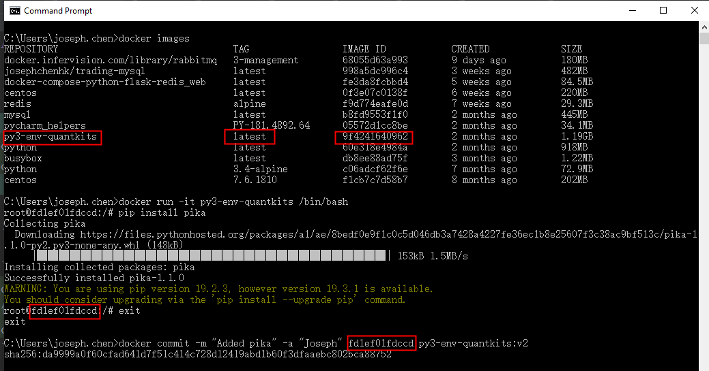
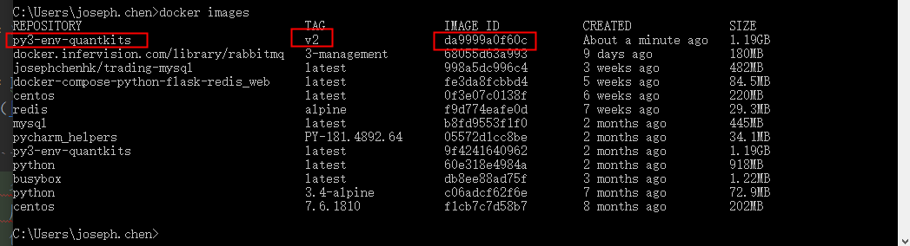

# Docker Tutorial

* 启动/停止一个docker container（名字为mysql的container）

```angular2html
docker start mysql
docker stop mysql
```

* 将docker里面的内容导出来

```angular2html
docker exec CONTAINER /usr/bin/mysqldump -u root --password=root DATABASE > backup.sql 
# 例子：注意如果在powershell里面跑下面这句导出sql，搬到unix环境导入时会有问题（Windows系统应该在cmd环境下跑这句）
docker exec mysql mysqldump -uroot -pAqumon2050@ test3 > test3.sql  
```

* 将test3.sql放在data文件夹里面 data/test3.sql，

* Dokerfile文件
（[Dockerfile指令详解](http://seanlook.com/2014/11/17/dockerfile-introduction/)）

```angularjs
# 名称：容器化的MySQL
# 用途：用作后端数据库持久化服务
# 创建时间：2019.10.24

#使用的基础镜像
FROM centos:7.6.1810

#添加作者信息
MAINTAINER josephchenhk josephchenhk@gmail.com

#安装mariadb数据库
RUN yum -y install mariadb-server

#设置环境变量，便于管理
ENV MARIADB_USER root
ENV MARIADB_PASS mypassword
#让容器支持中文
# ENV LC_ALL en_US.UTF-8

# 转移数据
COPY data /myDocker/data

#初始化数据库
ADD db_init.sh /myDocker/db_init.sh
RUN chmod 755 /myDocker/db_init.sh
RUN /myDocker/db_init.sh

#导出端口
EXPOSE 3306

#添加启动文件
ADD run.sh /myDocker/run.sh
RUN chmod 755 /myDocker/run.sh

#设置默认启动命令
#CMD ["/bin/sh", "-c", "/myDocker/run.sh"]
CMD /usr/bin/mysqld_safe
```

其中`db_init.sh`的内容如下：

```angularjs
mysql_install_db --user=mysql --force # 一定要加force才可以
sleep 3
mysqld_safe &
sleep 3

# 说明：如果不加--protocol=tcp，就会遇到Can't connect to local MySQL server through socket '/var/lib/mysql/mysql.sock' (2)
mysqladmin -u "$MARIADB_USER" password "$MARIADB_PASS"
mysql --protocol=tcp -u$MARIADB_USER -p$MARIADB_PASS -e "use mysql; grant all privileges on *.* to '$MARIADB_USER'@'%' identified by '$MARIADB_PASS' with grant option;"
mysql --protocol=tcp -u$MARIADB_USER -p$MARIADB_PASS -e "use mysql; update user set password=password('$MARIADB_PASS') where user='$MARIADB_USER' and host='localhost';"
mysql --protocol=tcp -u$MARIADB_USER -p$MARIADB_PASS -e "flush privileges;"
mysql --protocol=tcp -u$MARIADB_USER -p$MARIADB_PASS -e "create database test3;"

# 一种方法导入数据
mysql --protocol=tcp -u$MARIADB_USER -p$MARIADB_PASS -e "use test3; source /myDocker/data/test3.sql;"
# # 另一种方法导入数据
# mysql --protocol=tcp -uroot -pmypassword -D test3 < myDocker/data/test3.sql

# 确认数据库存在
mysql --protocol=tcp -u$MARIADB_USER -p$MARIADB_PASS -e "show databases;"

echo "privilege flushed"
```

* 制作image

`.`表示当前目录，`josephchenhk`是用户名，`trading-mysql`是镜像名
```angularjs
docker build -t josephchenhk/trading-mysql .
```

* docker-compose.yml文件

```angularjs
mysql:
  image: josephchenhk/trading-mysql
  environment:
    - MYSQL_ROOT_PASSWORD=mypassword
    - MYSQL_DATABASE=test3
  ports:
    - "127.0.0.1:3306:3306"
```

* 通过docker-compose来启动/停止docker容器

```angularjs
docker-compose up # 启动
docker-compose stop # 停止
```

* Docker 修改image


