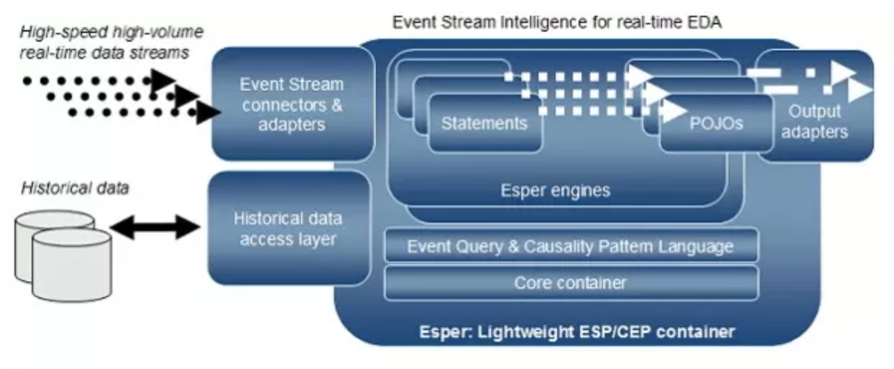
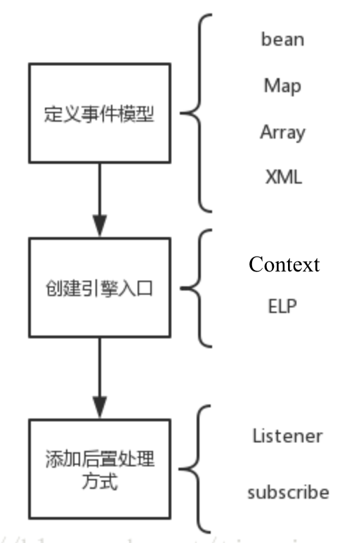
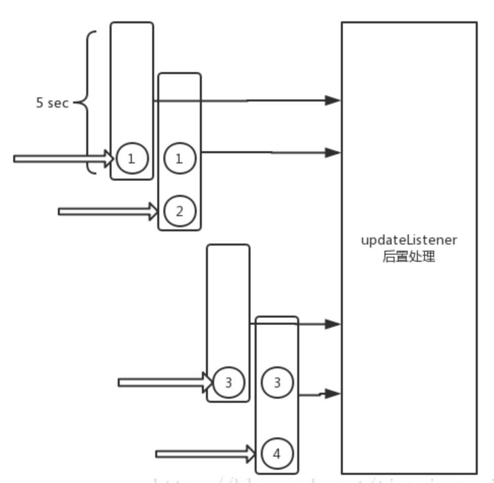
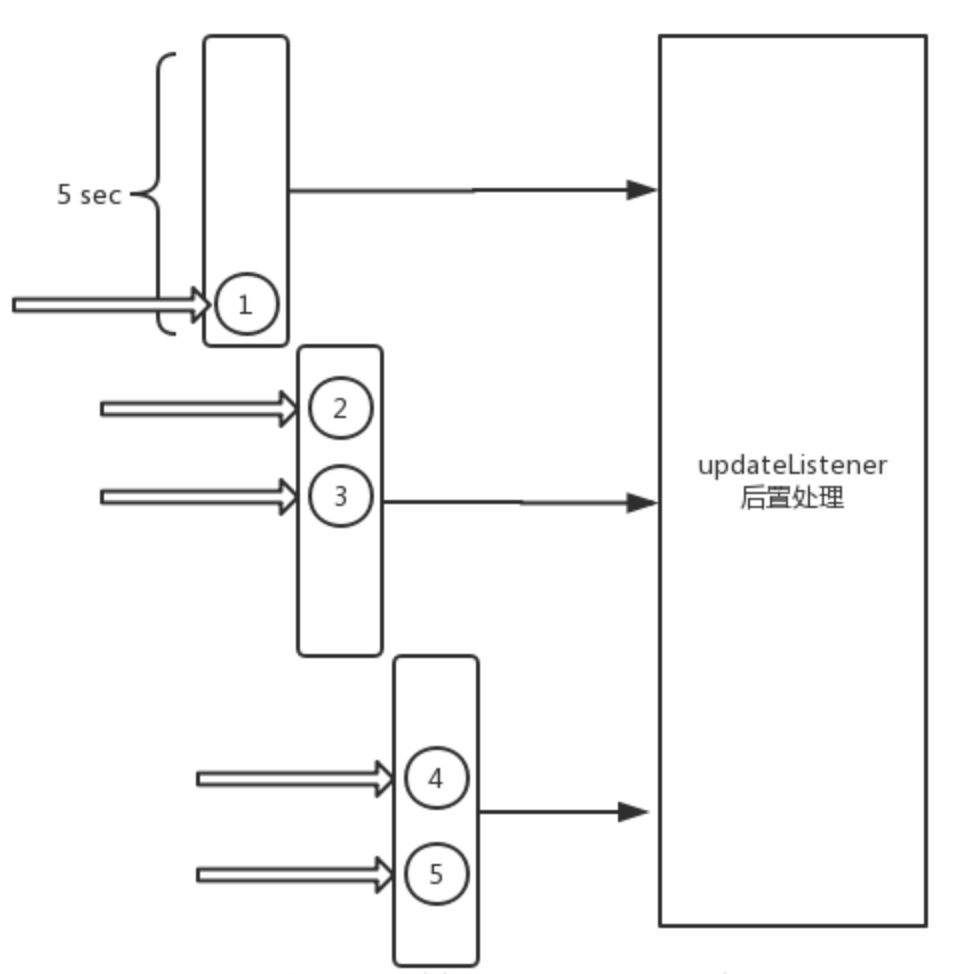

# Esper Tutorial

Esper is a language, a language compiler and a runtime environment (runs on JVM).

The esper language is the Event Processing Language (EPL)






## Input adapter 和 Output adapter
输入适配器和输出适配器的主要目的是接收来自不同事件源的事件，并向不同的目的地输出事件。 目前，Esper提供的适配器包括File Input and Output adpter, Spring JMS Input and Output Adapter, AMQP Input and Output Adapter, Kafka Adapter等等。这些适配器提供了一系列接口，可以让用户从不同的数据源读取数据，并将数据发送给不同的目的数据源，用户可以不用自己单独编写客户端代码来连接这些数据源，感觉相当于对这些数据源提供了一层封装。

## Esper engine
Esper引擎是处理事件的核心，它允许用户定义需要接收的事件以及对这些事件的处理方式。

## Esper支持的事件表现形式

Esper支持多种事件表现形势：包括遵循JavaBean方式的含有getter方法的Java POJO（普通Java对象），实现了Map接口的对象，对象数组，XML文档对象，以及Apache Avro（一个支持JSON和Schema的数据序列化系统，可以将数据结构或对象转化成便于存储和传输的格式）。这些事件表现形式的共同之处在于，它们都提供了事件类型的元数据，也就是说能够表示事件的一系列属性，例如，一个Java对象可以通过其成员变量来表示其事件属性，一个Map对象能够通过键值对来表示属性。由此可见，本质上事件是一系列属性值的集合，对事件的操作即对事件中的部分或全部属性的操作。

### 1. POJO
对于POJO，Esper要求对每一个私有属性要有getter方法。Esper允许不必按照JavaBean规定的格式，但是getter方法是必须的。又或者可以在配置文件中配置可访问的方法来代替getter。简单示例如下：

```javascript
public class Person
{
	String name;
	int age;
 
	public String getName()
	{
		return name;
	}
 
	public int getAge()
	{
		return age;
	}
}
```

执行下面EPL，将会得到名字为Joseph的数据

```javascript
select name,age from Person where name="Joseph"
```

Esper支持事件的更新，对此Esper要求提供对应的setter方法。


public class Person
{
	String name;
	int age;
 
	public String getName()
	{
		return name;
	}
	
	public int getAge()
	{
		return age;
	}
	
	public void setAge(int ageValue)
	{
		age = ageValue;
	}
}

执行如下EPL，将会更新Joseph的年龄：

```javascript
update Person set age=18 where name="Joseph"
```

### 2. Map

Esper支持原生Java Map结构的事件。相对于POJO来说，Map的结构更利于事件类型的热加载，毕竟不是class，所以不需要重启JVM。所以如果系统对重启比较敏感，建议使用Map来定义事件的结构。Map的结构很简单，主要分为事件定义名和事件属性列表。我们继续拿Person来讲解

```javascript
Map<String,Object> person = new HashMap<String,Object>();
person.put("name", String.class);
person.put("age", int.class);
person.put("children", List.class);
person.put("phones", Map.class);
```


## Esper事件处理模型
Esper事件处理模型主要包含两部分：

###（1）Statement 

利用Esper的事件处理语言EPL声明对事件进行的操作，Esper中提供了多种类型的事件操作，包括过滤、加窗、事件聚合等等。EPL是一种类似于SQL的语言，从这一点上来看，Esper恰好与数据库相反，数据库时保存数据，并在数据上运行查询语句，而Esper是保存查询语句，在这些查询上运行数据，只要事件与查询条件匹配，Esper就会实时进行处理，而不是只有在查询提交的时候才处理。

###（2）Listener

用于监听事件的处理情况，接收事件处理的结果，通过UpdateListener接口来实现，它相当于一个回调函数，当事件处理完成之后，可以通过该回调函数向结果发送到目的地。

## 基本语法

与SQL不同的地方，主要体现了实时性，与sql的持久数据形成对比我们列四点最重要的学习一下：insert、窗格、context、pattern。

### insert

首先用SQL的视角去想象，好像把数据保存起来这样的动作在Esper这样实时处理的工具中好像确实没有场景。
实际上insert在Esper中做的是转发的角色。即把某事件模型类的事件经过EPL运算后，insert成另外一种事件，去触发另外事件的处理流程。

### window

窗格应该是最有别于SQL的特性了，Esper的事件收集器支持事件积攒，分为两种积攒方式，时间和数量。

#### ``.win:time(5 sec)``



#### ``.win:time_batch(5 sec)``



#### ``.win:length(5 sec)``

#### ``.win:length_batch(5 sec)``

### pattern

pattern可以参考Ref2。

假定事件的进入顺序如下：

```
A1   B1   C1   B2   A2   D1   A3   B3   E1   A4   F1   B4
```

注意区分以下几种情形：

#### `every ( A -> B )`

 检测到的A事件后，通过B项。在当B出现的模式相匹配的时候。
 那么模式匹配重新启动，并期待在下一个的A事件。

 Matches on B1 for 组合 {A1, B1}
 Matches on B3 for 组合 {A2, B3}
 Matches on B4 for 组合 {A4, B4}


#### `every A -> B`

 该模式每当进入一个B 事件就去匹配他前面的所有A 事件
 Matches on B1 for 组合 {A1, B1}
 Matches on B3 for 组合 {A2, B3} and {A3, B3}
 Matches on B4 for 组合 {A4, B4}


#### `A -> every B`

 该模式触发A 事件后，每进入一个B 事件都触发
 Matches on B1 for 组合 {A1, B1}.
 Matches on B2 for 组合 {A1, B2}.
 Matches on B3 for 组合 {A1, B3}
 Matches on B4 for 组合 {A1, B4}


#### `every A -> every B`

 通过每个B 事件触发每个A 事件
 Matches on B1 for 组合 {A1, B1}.
 Matches on B2 for 组合 {A1, B2}.
 Matches on B3 for 组合 {A1, B3} and {A2, B3} and {A3, B3}
 Matches on B4 for 组合 {A1, B4} and {A2, B4} and {A3, B4} and {A4, B4}

## Java Esper接口

以最新的version8.6.0为例（注意与旧版本接口有所不同）

### compiler

1）配置compiler路径

将compiler.jar添加到program的classpath

2）编写Event

一个例子，注意需要实现getter方法。

```javascript
package com.mycompany.myapp;

public class PersonEvent {
    private String name;
    private int age;

    public PersonEvent(String name, int age) {
        this.name = name;
        this.age = age;
    }

    public String getName() {
        return name;
    }

    public int getAge() {
        return age;
    }
}
```

3）编写EPL

```javascript
String epl = "@name('my-statement') select name, avg(age) from PersonEvent"
```

4) 调用compiler进行编译

```javascript
# 调出compiler
EPCompiler compiler = EPCompilerProvider.getCompiler();

# 将事件注册进compiler的参数
Configuration configuration = new Configuration();
configuration.getCommon().addEventType(PersonEvent.class);
CompilerArguments args = new CompilerArguments(configuration);
	
# 进行编译			
EPCompiled epCompiled;
try {
  epCompiled = compiler.compile("@name('my-statement') select name, age from PersonEvent", args);
}
catch (EPCompileException ex) {
  // handle exception here
  throw new RuntimeException(ex);
}
```

### Runtime

1）配置runtime路径

将如下两个文件加入classpath：

* Common jar file esper-common-version.jar

* Runtime jar file esper-runtime-version.jar

2）部署进runtime

```javascript
# 调出runtime
EPRuntime runtime = EPRuntimeProvider.getDefaultRuntime(configuration);

# 将编译好的bytecode部署进runtime
EPDeployment deployment;
try {
  deployment = runtime.getDeploymentService().deploy(epCompiled);
}
catch (EPDeployException ex) {
  // handle exception here
  throw new RuntimeException(ex);
}

# 编写Listener

EPStatement statement = runtime.getDeploymentService().getStatement(deployment.getDeploymentId(), "my-statement");
			
statement.addListener( (newData, oldData, statement, runtime) -> {
  String name = (String) newData[0].get("name");
  int age = (int) newData[0].get("age");
  System.out.println(String.format("Name: %s, Age: %d", name, age));
});
```

### sendEvent

```javascript
runtime.getEventService().sendEventBean(new PersonEvent("Peter", 10), "PersonEvent");
```


Ref:

1. [Esper复杂事务处理引擎一小时入门](https://blog.csdn.net/tianxiawucai/article/details/79507160)

2. [Esper事件处理引擎_15_EPL 语法_7_Patterns_2_模式匹配](https://my.oschina.net/huluerwa/blog/311318)

3. [Esper官方发布8.6.0](http://esper.espertech.com/release-8.6.0/)