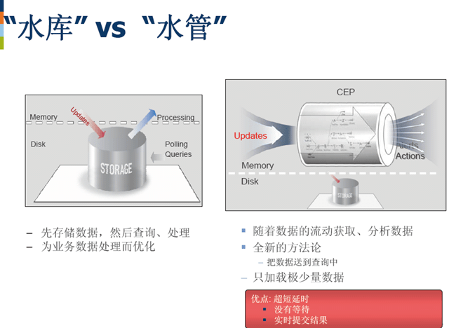
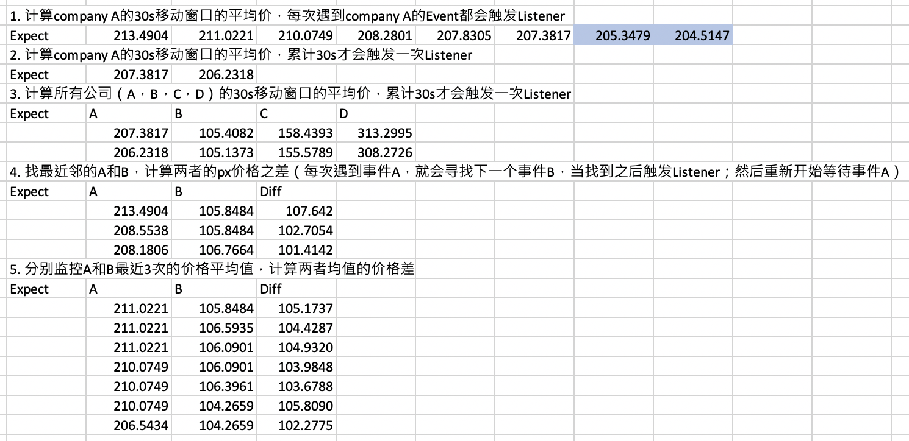

# Complex Event Processing (CEP)

### 内部培训
###  Joseph Chen， 2021-01-19

# -----------------------------------

1. [数据适配器](#adapter)

2. [Esper引擎（engine）](#esper-engine)

3. [Esper支持的事件（Event）表现形式](#esper-event)

    3.1 [POJO](#pojo)

    3.2 [Map](#map)

4. [Esper事件处理模型](#esper-model)

    4.1 [statement](#statement)

    4.2 [listener](#listener)

5. [EPL基本语法](#epl)

    5.1 [insert](#insert)

    5.2 [window](#window)

    5.3 [pattern](#pattern)

6. [Java Esper接口](#java-esper)

    6.1 [Compiler](#compiler)

    6.2 [Runtime](#runtime)

    6.3 [sendEvent](#sendevent)

7. [一些例子](#esper-sample)

8. [CEP in Q](#q-introduction)

    8.1 [Q数据类型](#q-console-types-and-lists)

    8.2 [标量和矢量](#scalar-and-vector)

    8.3 [运算顺序](#precedence)

    8.4 [til函数](#til)

    8.5 [在kdb/Q里面创建一个表](#table)

    8.6 [应用Q处理复杂事件](#cep-in-q)


# -----------------------------------


复杂事件处理（Complex Event Processing）是一种新兴的基于事件流的技术，通过系统数据串行不同类型的事件，通过分析事件间的关系，建立不同的事件关系序列库，利用过滤，关联，聚合 CEP适合的场景包括实时风险管理，实时交易分析，网络诈欺，网络攻击，市场趋势分析等等。

CEP的几大特点：

* 基于数据流
* 时间序列
* 实时
* 复杂



Esper is a language, a language compiler and a runtime environment (runs on JVM).

The esper language is the Event Processing Language (EPL)


## adapter
输入适配器和输出适配器的主要目的是接收来自不同事件源的事件，并向不同的目的地输出事件。 目前，Esper提供的适配器包括File Input and Output adpter, Spring JMS Input and Output Adapter, AMQP Input and Output Adapter, Kafka Adapter等等。这些适配器提供了一系列接口，可以让用户从不同的数据源读取数据，并将数据发送给不同的目的数据源，用户可以不用自己单独编写客户端代码来连接这些数据源，感觉相当于对这些数据源提供了一层封装。

## esper engine
Esper引擎是处理事件的核心，它允许用户定义需要接收的事件以及对这些事件的处理方式。

## esper event

Esper支持多种事件表现形势：包括遵循JavaBean方式的含有getter方法的Java POJO（普通Java对象），实现了Map接口的对象，对象数组，XML文档对象，以及Apache Avro（一个支持JSON和Schema的数据序列化系统，可以将数据结构或对象转化成便于存储和传输的格式）。这些事件表现形式的共同之处在于，它们都提供了事件类型的元数据，也就是说能够表示事件的一系列属性，例如，一个Java对象可以通过其成员变量来表示其事件属性，一个Map对象能够通过键值对来表示属性。由此可见，本质上事件是一系列属性值的集合，对事件的操作即对事件中的部分或全部属性的操作。

### POJO
对于POJO，Esper要求对每一个私有属性要有getter方法。Esper允许不必按照JavaBean规定的格式，但是getter方法是必须的。又或者可以在配置文件中配置可访问的方法来代替getter。简单示例如下：

```javascript
public class Person
{
	String name;
	int age;

	public String getName()
	{
		return name;
	}

	public int getAge()
	{
		return age;
	}
}
```

执行下面EPL，将会得到名字为Joseph的数据

```javascript
select name,age from Person where name="Joseph"
```

Esper支持事件的更新，对此Esper要求提供对应的setter方法。


public class Person
{
	String name;
	int age;

	public String getName()
	{
		return name;
	}

	public int getAge()
	{
		return age;
	}

	public void setAge(int ageValue)
	{
		age = ageValue;
	}
}

执行如下EPL，将会更新Joseph的年龄：

```javascript
update Person set age=18 where name="Joseph"
```

### Map

Esper支持原生Java Map结构的事件。相对于POJO来说，Map的结构更利于事件类型的热加载，毕竟不是class，所以不需要重启JVM。所以如果系统对重启比较敏感，建议使用Map来定义事件的结构。Map的结构很简单，主要分为事件定义名和事件属性列表。我们继续拿Person来讲解

```javascript
Map<String,Object> person = new HashMap<String,Object>();
person.put("name", String.class);
person.put("age", int.class);
person.put("children", List.class);
person.put("phones", Map.class);
```


## esper model

Esper事件处理模型主要包含两部分：

### statement

利用Esper的事件处理语言EPL声明对事件进行的操作，Esper中提供了多种类型的事件操作，包括过滤、加窗、事件聚合等等。EPL是一种类似于SQL的语言，从这一点上来看，Esper恰好与数据库相反，数据库时保存数据，并在数据上运行查询语句，而Esper是保存查询语句，在这些查询上运行数据，只要事件与查询条件匹配，Esper就会实时进行处理，而不是只有在查询提交的时候才处理。

### listener

用于监听事件的处理情况，接收事件处理的结果，通过UpdateListener接口来实现，它相当于一个回调函数，当事件处理完成之后，可以通过该回调函数向结果发送到目的地。

## epl

与SQL不同的地方，主要体现了实时性，与sql的持久数据形成对比我们列四点最重要的学习一下：insert、窗格、context、pattern。

### insert

首先用SQL的视角去想象，好像把数据保存起来这样的动作在Esper这样实时处理的工具中好像确实没有场景。
实际上insert在Esper中做的是转发的角色。即把某事件模型类的事件经过EPL运算后，insert成另外一种事件，去触发另外事件的处理流程。

### window

窗格应该是最有别于SQL的特性了，Esper的事件收集器支持事件积攒，分为两种积攒方式，时间和数量。

#### ``.win:time(5 sec)``


#### ``.win:time_batch(5 sec)``


#### ``.win:length(5 sec)``

#### ``.win:length_batch(5 sec)``

### pattern

pattern可以参考Ref2。

假定事件的进入顺序如下：

```
A1   B1   C1   B2   A2   D1   A3   B3   E1   A4   F1   B4
```

注意区分以下几种情形：

#### `every ( A -> B )`

 检测到的A事件后，通过B项。在当B出现的模式相匹配的时候。
 那么模式匹配重新启动，并期待在下一个的A事件。

 Matches on B1 for 组合 {A1, B1}
 Matches on B3 for 组合 {A2, B3}
 Matches on B4 for 组合 {A4, B4}


#### `every A -> B`

 该模式每当进入一个B 事件就去匹配他前面的所有A 事件
 Matches on B1 for 组合 {A1, B1}
 Matches on B3 for 组合 {A2, B3} and {A3, B3}
 Matches on B4 for 组合 {A4, B4}


#### `A -> every B`

 该模式触发A 事件后，每进入一个B 事件都触发
 Matches on B1 for 组合 {A1, B1}.
 Matches on B2 for 组合 {A1, B2}.
 Matches on B3 for 组合 {A1, B3}
 Matches on B4 for 组合 {A1, B4}


#### `every A -> every B`

 通过每个B 事件触发每个A 事件
 Matches on B1 for 组合 {A1, B1}.
 Matches on B2 for 组合 {A1, B2}.
 Matches on B3 for 组合 {A1, B3} and {A2, B3} and {A3, B3}
 Matches on B4 for 组合 {A1, B4} and {A2, B4} and {A3, B4} and {A4, B4}

## java esper

以最新的version8.6.0为例（注意与旧版本接口有所不同）

### Compiler

1）配置compiler路径

将compiler.jar添加到program的classpath

2）编写Event

一个例子，注意需要实现getter方法。

```javascript
package com.mycompany.myapp;

public class PersonEvent {
    private String name;
    private int age;

    public PersonEvent(String name, int age) {
        this.name = name;
        this.age = age;
    }

    public String getName() {
        return name;
    }

    public int getAge() {
        return age;
    }
}
```

3）编写EPL

```javascript
String epl = "@name('my-statement') select name, avg(age) from PersonEvent"
```

4) 调用compiler进行编译

```javascript
# 调出compiler
EPCompiler compiler = EPCompilerProvider.getCompiler();

# 将事件注册进compiler的参数
Configuration configuration = new Configuration();
configuration.getCommon().addEventType(PersonEvent.class);
CompilerArguments args = new CompilerArguments(configuration);

# 进行编译
EPCompiled epCompiled;
try {
  epCompiled = compiler.compile("@name('my-statement') select name, age from PersonEvent", args);
}
catch (EPCompileException ex) {
  // handle exception here
  throw new RuntimeException(ex);
}
```

### Runtime

1）配置runtime路径

将如下两个文件加入classpath：

* Common jar file esper-common-version.jar

* Runtime jar file esper-runtime-version.jar

2）部署进runtime

```javascript
# 调出runtime
EPRuntime runtime = EPRuntimeProvider.getDefaultRuntime(configuration);

# 将编译好的bytecode部署进runtime
EPDeployment deployment;
try {
  deployment = runtime.getDeploymentService().deploy(epCompiled);
}
catch (EPDeployException ex) {
  // handle exception here
  throw new RuntimeException(ex);
}

# 编写Listener

EPStatement statement = runtime.getDeploymentService().getStatement(deployment.getDeploymentId(), "my-statement");

statement.addListener( (newData, oldData, statement, runtime) -> {
  String name = (String) newData[0].get("name");
  int age = (int) newData[0].get("age");
  System.out.println(String.format("Name: %s, Age: %d", name, age));
});
```

### sendEvent

```javascript
runtime.getEventService().sendEventBean(new PersonEvent("Peter", 10), "PersonEvent");
```

## esper sample


思考问题：

1. 计算company A的30s移动窗口的平均价，每次遇到company A的Event都会触发Listener

2. 计算company A的30s移动窗口的平均价，累计30s才会触发一次Listener

3. 计算所有公司（A，B，C，D）的30s移动窗口的平均价，累计30s才会触发一次Listener

4. 找最近邻的A和B，计算两者的px价格之差（每次遇到事件A，就会寻找下一个事件B，当找到之后触发Listener；然后重新开始等待事件A）

5. 分别监控A和B最近3次的价格平均值，计算两者均值的价格差


答案（需重新排序）：

(a) `select avg(px) as avgPrice30Sec, company from Event.win:time_batch(30 sec) group by company;`

(b) `select avg(px) as avgPrice30Sec, company from Event.win:time(30 sec) where company="A"`

(c) `select avg(px) as avgPrice30SecBatch, company from Event.win:time_batch(30 sec) where company="A";`

(d)
```shell
insert into A select avg(px) as price, company from Event(company=\"A\").win:length(3);
insert into B select avg(px) as price, company from Event(company=\"B\").win:length(3);
select A.price as priceA, B.price as priceB, (A.price-B.price) as priceDiff from A.win:length(1), B.win:length(1);
```

(e)
`select a.px as priceA, b.px as priceB, (a.px-b.px) as priceDiff from pattern [every a=Event(company="A") -> b=Event(company="B")];`




## q introduction

與傳統編程語言不同，Q programming：

* 沒有work flow的概念，不存在if-else這樣的語句結構
* 沒有object的概念，不存在繼承的關係
* 沒有thread的概念
* 沒有shared mutable globals

### q console types and lists

Q是動態類型語言，無需顯式指定類型。

|描述       | Q      | Python |        解釋     |
|:--------:|:------:|:------:|:--------------:|
|加        | +      |   +     |                |
|減        | -      |   -     |                |
|乘        | *      |   *     |                |
|除        | %      |   /     | Python %表示取餘數|
|布爾值     | 1b, 0b |True,False|                |
|64位整數   | 42     |   42    |                |
|32位整數   | 42i    |   42    |                |
|浮點數     | 42f    |   42    |Q只要寫小數點就會當成浮點數，例如42.0|
|數值列表   | 1 2 3  |[1,2,3]  | Q numeric List只用空格分開|
|布爾值列表  | 101b  |[True,False,True]  | Q boolean List不用任何分隔符，只需在最後加上b|

列表相加（element-wise）：

```shell
q)） 1 2 3+4 6 7
5 8 10
```

### scalar and vector

將一個標量（scalar）與矢量（vector）相作用，相當於對每一個元素操作：

```shell
q))5+1 2 3
6 7 8
q))1 2 3+5
6 7 8
q))2%1 2 3
2 1 0.6666667
q))1 2 3%2
0.5 1 1.5
```

### precedence

Q 沒有precedence（符合運算優先次序），所有的運算遵循**從右至左**的次序。當然，可以加上括號令其優先級更高。

```shell
q))2*3+4
14
q))2*(3+4)
14
q))(2*3)+4
10
```

### til

`til N`表示返回一個從0開始，步長為1，總長度為N的列表

```shell
q))til 4
0 1 2 3
q))count til 10000
10000
q))1+til 10000
1 2 3 4 5 6 7 8 9 10 11 12 13 14 15 16 17 18 19 20 21 22 23 24 25 26 27 28 29..
```

### table

```shell
q)N:3600
q)times:09:30:00.0000+1000*til N
q)idx:N?4
q)syms:`A`B`C`D idx
q)pxs:(1+N?0.1)*200 100 150 300 idx
q)table:([] time:times;sym:syms;price:pxs)
```

也可以将上述语句写进一个脚本 createdata.q:

```javascript
N:3600;
times:09:30:00.0000+1000*til N;
idx:N?4;
syms:`A`B`C`D idx;
pxs:(1+N?0.1)*200 100 150 300 idx;
table:([] time:times;sym:syms;price:pxs);
```

然后在q console里面执行该脚本：

```javascript
q)\l /tmp/createdata.q
```

### cep in q

1. 计算company A的30s移动窗口的平均价，每次遇到company A的Event都会触发Listener

```shell
lookback:1000*29;
ctable:a#table;
ctime:last ctable[`time];
window:select avg price,sym from ctable where (sym=`A) & (time within (ctime-lookback;ctime));
```

### open questions

*思考*：上述esper的其他例子，如何用Q实现？


# Ref:

1. [Esper官方发布8.6.0](http://esper.espertech.com/release-8.6.0/)

2. [kdb/Q学习资料](https://code.kx.com/q/learn/startingkdb/)
