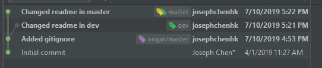
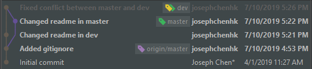
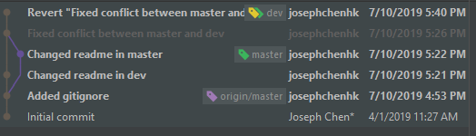
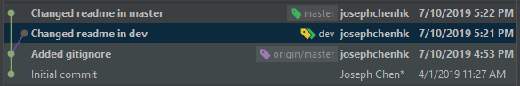
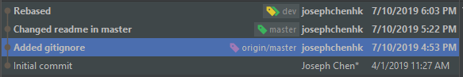

# quantkits
## 简单的Git Tutorial

配置用户名和邮箱

* config
```shell
git config --global user.name "joseph"
git config --global user.email "josephchenhk@gmail.com"
```
如果没有--global参数，则表示local设置；如果没有后面的"XXX"，则查看config。

* merge

假如你在dev分支开发，与此同时master分支也有了更新：



你可以选择将master分支合并到dev：
```shell
git checkout dev
git merge master
```



* log

你可以通过 `git log -n` 查找最近n条commit记录. 更简洁的命令是 `git log --oneline -n` ，n是最近几多次提交的记录。

回撤至旧记录，有两种方法：1. revert（会创建一个和旧commit一模一样的commit，从而达到后退的目的）；2. reset（会彻底消灭旧的commit，如果带--hard参数，就不单只缓存区，连工作区也会回退。这个操作不可撤销，要慎重！）

* revert
```shell
git revert HEAD -m 1
```
对于merge的revert，需要提供-m参数，1/2分别对应dev和master分支. revert后如下：


* reset

主要用于撤销git add（撤销提交至缓存区的提交）
```shell
git reset <commit-id>
```


假如提交记录如下：
```
$ git log --oneline -5 // 最近5次提交记录
ba2f0a4 (HEAD -> master, origin/master) test4 //最新提交的记录
f3a6683 test3 // 上一个提交的记录
4f0f054 test2
6fefa2d test1
77f9ec8 reset
```

则通过`git reset --hard HEAD`(或者`git reset --hard ba2f0a4`)回到最新的提交test4；通过`git reset --hard HEAD~`(或者`git reset --hard f3a6683`)回到上一个提交test3；通过`git reset --hard HEAD~2`(或者`git reset --hard 4f0f054`)回到最新的提交test2.

最后大杀招，通过interactive rebase的方式将当前dev分支rebase到master分支：

* rebase
```shell
git rebase -i master
```


* stash

查看现有的储藏，
```shell
$ git stash list
stash@{0}: WIP on master: 049d078 added the index file
stash@{1}: WIP on master: c264051 Revert "added file_size"
stash@{2}: WIP on master: 21d80a5 added number to log
```

应用储藏，

```shell
$ git stash apply              # 等价于 git stash apply stash@{0}
$ git stash apply stash@{2}    # 应用stash@{2}
```

以上命令只恢复工作区，如果想连暂存区也恢复，需要加上--index参数

```shell
$ git stash apply --index
```

移除stash，用drop：

```shell
$ git stash drop stash@{0}
```
